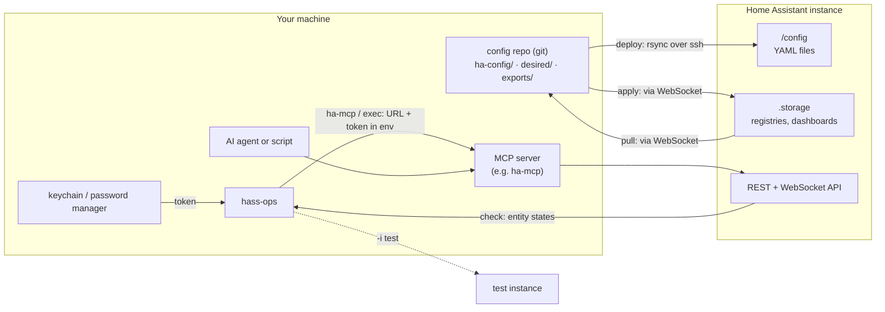

# Architecture

How hass-ops fits between your repository and your Home Assistant instance: what data moves, which way, and
why, and what keeps each move safe.

## The big picture

The config repository is the source of truth for what you write; the instance is the source of truth for what
it has. hass-ops moves data between them in both directions, and never in a way you did not see first:

| Data                                                      | From → to                     | Command          | Why                                                     |
|-----------------------------------------------------------|-------------------------------|------------------|---------------------------------------------------------|
| YAML config (`configuration.yaml`, packages, automations) | repo `ha-config/` → `/config` | `deploy`         | your edits go live, reviewed and committed              |
| Entity ids and states                                     | instance → your terminal      | `check`          | every reference in the YAML is confirmed to exist       |
| Registries and UI dashboards                              | instance → repo `exports/`    | `pull`, `drift`  | UI changes become a commit, or a warning                |
| Entities and dashboards you pick                          | `exports/` → `desired/`       | `promote`        | "I meant that change" becomes managed state             |
| Names, areas, labels, dashboards                          | repo `desired/` → instance    | `apply`          | declared state is enforced, and restored after UI drift |
| URL and token                                             | keychain → a child process    | `exec`, `ha-mcp` | scripts and MCP servers use the same instance and token |

## The registries: state you depend on but cannot see

Home Assistant keeps a registry for each of entities, devices, areas, floors and labels. They are not in any
YAML file, yet the rest of your configuration leans on them:

- The **entity registry** binds each entity to its integration through a `unique_id`, and holds what you
  set on it: its `entity_id`, name, icon, area, labels, and whether it is hidden or disabled. Every
  automation, script, template and dashboard refers to entities by that `entity_id`.
- The **device registry** holds each device's name as you set it, its area and its labels. Entities without
  an area of their own take the device's.
- **Areas, floors and labels** are what `target: area_id:`, voice assistants, dashboards and the UI's filters
  are built on.

All of it is set by clicking in the UI and stored in `.storage`, which Home Assistant rewrites as it runs, so
editing the files by hand does not stick. It has no history. A rename made from a phone, an entity moved to
another area, or an integration update that changes an `entity_id` is invisible to git, and can quietly break
automations that refer to the old id. Rebuilding it on another instance means clicking it all again.

hass-ops makes the registries something you can version:

- `pull` writes them out as sorted YAML, so they are in git and `git diff` shows every change.
- `drift` fails when they changed outside the repository.
- `desired/entity-map.yaml` declares the names, ids, areas and labels you want, keyed on `unique_id`, which
  is the same on every instance. The same file applies to a test instance and to your house.
- `apply` makes the instance match, through the same registry calls the UI uses. Renaming an `entity_id`
  this way is a registry rename like one made in the UI, so recorded history stays with the entity.

## How it keeps that safe

- **One answer to "which instance?".** `hass-ops.toml` lists your instances. The target is resolved once, from
  `-i`, then `HA_INSTANCE`, then the default, and printed before anything connects. Every write logs its
  target before it acts. A test instance is one flag away.
- **Tokens stay in your keychain.** Each instance names a `token_command` (a Keychain, `pass` or 1Password
  lookup); it runs only for the targeted instance, and the token is never printed or written to a file.
- **Nothing writes without showing you first.** `deploy` prints its rsync dry run and lists planned deletions on
  their own, then asks. `apply` and `promote` print a plan and send nothing without `--write`.
- **Hard stops where a mistake is expensive.** `deploy` runs `check` first, refuses any deletion touching
  `.storage`, a database or `secrets.yaml` whatever your exclude list says, and ends with `ha core check`.
  `apply` validates every area, label and entity before the first write, so a typo sends nothing.
- **Sparse, idempotent desired state.** `apply` touches only what `desired/` names; leaving a field out
  leaves it alone, `null` clears it. A second run plans nothing.
- **Diffs that mean something.** `pull` sorts on stable ids, keeps only listed fields (never integration
  credentials), and drops what changes by itself, such as timestamps and firmware versions. An unchanged
  instance pulls to identical files.

## Inside hass-ops

For contributors: a small Python package, `src/hass_ops/`.

| Module                                           | Does                                                                                              |
|--------------------------------------------------|---------------------------------------------------------------------------------------------------|
| `cli.py`                                         | the `hass-ops` command: resolves the project and instance, then hands off to a command module     |
| `project.py`                                     | finds and reads `hass-ops.toml`, chooses the instance, runs `token_command`, sets the environment |
| `ha_api.py`                                      | REST client; standard library only, since every other module imports it                           |
| `ha_ws.py`                                       | WebSocket client, for the registries and dashboards, which have no REST API                       |
| `validate/entity_refs.py`                        | `check`                                                                                           |
| `validate/hacs.py`                               | `hacs resources` and `hacs preflight`                                                             |
| `pull.py`, `promote.py`, `apply.py`, `reload.py` | the commands of the same names                                                                    |
| `deploy.sh`                                      | the rsync and its guards, run by `deploy`                                                         |

Each command is a module with a `main()` that parses its own arguments; `cli.py` lists them in `COMMANDS`. The
clients read only the environment `project.py` sets (`HA_INSTANCE`, `HA_<NAME>_URL`, `HA_<NAME>_TOKEN`), so a
script run through `hass-ops exec` can use them too.
